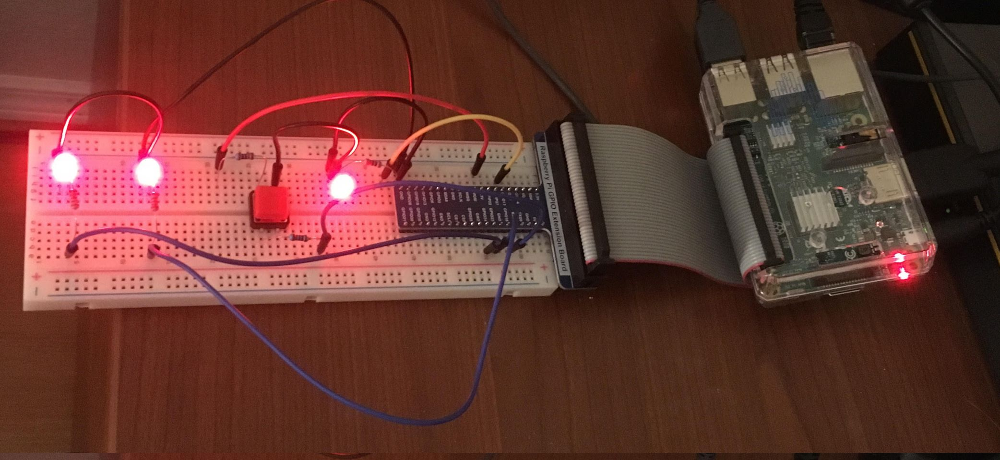

# Overview

This kernel module for Raspbian uses parameters to specify a number of LEDs and and a button on GPIO such that the LEDs form a binary counter of the number of times the button is pushed. 



# Building

# Sysfs integration

Entries appear under `/sys/kernel/gpiocount`

```
$ ls -l /sys/kernel/gpiocount
total 0
-rw-r--r-- 1 root root 4096 Jun 16 13:55 gpio_button_increment
-rw-r--r-- 1 root root 4096 Jun 16 13:55 gpio_leds
--w------- 1 root root 4096 Jun 16 13:55 increment
-rw-r--r-- 1 root root 4096 Jun 16 13:55 max_value
-rw-r--r-- 1 root root 4096 Jun 16 13:55 value
```

Their uses are as follows:

| Entry | Function |
| ----- | -------- |
| `gpio_button_increment` | Read or set a single GPIO assignment for the increment button. |
| `gpio_leds` | Read or set a comma-separated list (without whitespace) of GPIOs to be used for the LEDs, most significan digit first. |
| `increment` | Increment the current value. Also updates `max_value` if appropriate. Rolls over to 0 (without updating `max_value`) if there are not sufficient digits to display the new value. |
| `max_value` | The highest `value` ever reached. |
| `value` | Read or set the current value. Also updates `max_value` if appropriate. Rolls over to 0 (without updating `max_value`) if there are not sufficient digits to display the new value. |

# Installing

A boolean module paramater is used to enable all the GPIO interactions. If you do not have an attached circuit you can stull run the module and interact with it via sysfs entries, in which case, install it wihtout setting the parameter.

```
sudo insmod gpiocount.ko
```

Once you do have a circuit attached, install the module as follows. No actual GPIOs or interrupt handlers will be register until after you configure the buttons and LEDs via sysfs entries. 

```
sudo insmod gpiocount.ko enable_gpio=1
```

# Uninstalling

```
sudo rmmod gpiocount.ko 
```

# Usage

Using the model entails configuring the GPIOs that are being used for the botton and the LEDs. The configuration and state can also be observed using sysfs enbtries. 

In the following example we will use three available GPIOs to configure a two-digit counter. 

## Button Setup and Confirmation

```
$ echo 18 | sudo tee -a /sys/kernel/gpiocount/gpio_button_increment
18
```

```
$ cat /sys/kernel/gpiocount/gpio_button_increment
18 
```

## LED Setup and Confirmation

The LED GPIOs are specified in a comma-separated list, low bit to high bit.

```
$ echo 17,23 | sudo tee -a /sys/kernel/gpiocount/gpio_leds
17,23
```

```
$ cat /sys/kernel/gpiocount/gpio_leds
17,23
```

## Counting

| Actions | Value | Max Value | LED 23 | LED 17 |
| ------- | ----- | ----------| ------ | ------ |
| (initial) | 0 | 0 | 0 | 0 | 
| 1st button press | 1 | 1 | 0 | 1 |
| 2nd button press | 2 | 2 | 1 | 0 |
| 3rd button press | 3 | 3 | 1 | 1 |
| 4th button press | 0 | 3 | 0 | 0 | 
| 5th button press | 1 | 3 | 0 | 1 | 


## State Observation and Manipulation

To observe the current value:
```
$ sudo cat /sys/kernel/gpiocount/value
```

To observe the maximum value:

```
$ sudo cat /sys/kernel/gpiocount/max_value
```

To increment without pressing the button -- any value can be used:

```
$ echo hello | sudo tee -a /sys/kernel/gpiocount/increment
```

To change the current value:

```
$ echo 3 | sudo tee -a /sys/kernel/gpiocount/value
```

# TODO

* what about multithreading?
* button reset (double click)
* test all leds by flashing them (in clear sequence from lo) 

# References

[http://derekmolloy.ie/kernel-gpio-programming-buttons-and-leds/]

[https://blog.fazibear.me/the-beginners-guide-to-linux-kernel-module-raspberry-pi-and-led-matrix-790e8236e8e9]